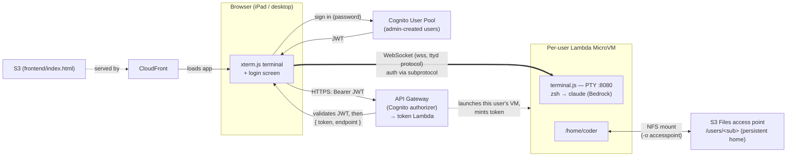

# iPad Claude Code

A browser-based terminal — built for the iPad, works anywhere — that runs
[Claude Code](https://www.anthropic.com/claude-code) inside an **AWS Lambda
MicroVM**, with a persistent home directory backed by **Amazon S3**. Open a URL,
log in, and you're in a real shell with Claude Code running against Amazon
Bedrock. Close the tab and come back later — your files, history, and installed
tools are still there.

> ⚠️ **This is a demo / small-team project, not a hardened product.** Auth is
> Cognito (admin-created users, per-user MicroVMs), but the sandbox runs with a
> broadly-privileged AWS role. Read the [Security](#security) section before
> deploying anywhere sensitive.

---

## How it works



- **Frontend** — a single `index.html` (xterm.js) on S3, served via CloudFront.
  The user signs in against Cognito (via `amazon-cognito-identity-js`), gets a
  JWT, then opens a WebSocket straight to their MicroVM's service-managed
  endpoint, authenticating via the `lambda-microvms.*` subprotocols. On the wire
  it speaks the ttyd binary protocol.
- **Auth — Cognito + API Gateway.** A Cognito User Pool holds admin-created
  users (no self-signup). **API Gateway's Cognito authorizer validates the JWT
  before the token Lambda ever runs** — the Lambda never sees a password, only
  the already-verified identity.
- **Token Lambda** — reads the verified Cognito `sub` from the request context,
  finds-or-creates that user's S3 Files access point (scoped to `/users/<sub>`),
  launches or resumes **that user's own MicroVM**, and mints a short-lived auth
  token. Hand-rolled SigV4, so it's immune to AWS CLI command-name churn.
- **MicroVM image** — Amazon Linux 2023 + Node, Python 3.13, the AWS CLI, `uv`,
  and Claude Code (pointed at Bedrock). `terminal.js` is a WebSocket PTY server.
  The per-user home is mounted at run time by the `/run` lifecycle hook (which
  receives the access-point id in its payload) — `mount -o accesspoint=<id>` —
  so each user gets an isolated `/home/coder` that persists across restarts.
- **SAM template** (`template.yaml`) — VPC + security group, the S3 buckets
  (frontend / artifacts / workspace), the S3 Files filesystem + mount targets,
  the Cognito pool + authorizer, IAM roles, the token Lambda + API Gateway,
  CloudFront, and a Lambda Network Connector for VPC egress to the S3 Files
  mount targets. One `sam deploy` provisions all of it.

**Per-user isolation:** each Cognito user gets their own MicroVM and their own
home directory (an S3 Files access point scoped to their `sub`). Adding a user
in the pool is all it takes — their first login provisions their VM and home on
demand.

Default model is **Claude Opus 4.8** on Bedrock; `/model` switches to Fable 5,
Sonnet 5, or Haiku 4.5 (Fable requires US data residency, hence Opus as the
portable default).

---

## Prerequisites

- An AWS account with **Bedrock model access enabled** for whichever Claude
  models you want to use. The default is Opus 4.8, but it runs on any Bedrock
  Claude model — enable Haiku 4.5 alone if you want the cheapest option, and set
  it as the default (see `microvm/terminal.js` / the seeded shell config).
- **AWS Lambda MicroVMs** available in your region (this project uses
  `us-east-1`). MicroVMs are a newer capability — make sure your account/region
  has access.
- Local tooling: **AWS CLI v2**, the **AWS SAM CLI**, and **Node.js 20+**. Docker
  is *not* required — the MicroVM image is built server-side by the build service.

The SAM stack provisions everything, including the **S3 Files filesystem** and
its VPC mount targets (the persistent per-user `/home/coder`). You don't create
anything by hand — `sam deploy` makes it all.

---

## Deploy — the three stages

The system has three deployable layers, and it's worth understanding each one
before reaching for the script. Configure first, then walk the stages. (There's
a one-command script at the end — but do it by hand once; that's the point of
this repo.)

**Configure.** Copy the example and fill in your values:

```bash
cp config.env.example config.env
$EDITOR config.env       # AWS_ACCOUNT, AWS_PROFILE, region, ...
source config.env        # export the vars for the commands below
```

`config.env` is git-ignored, so your account ID never gets committed. The
commands below assume `$AWS_PROFILE`, `$AWS_REGION`, `$AWS_ACCOUNT`, and
`$IMAGE_NAME` are exported from it.

### Stage 1 — Infrastructure (SAM)

The whole stack is one AWS SAM template (`template.yaml`): the VPC + NAT +
subnets + NFS security group, the three S3 buckets, the **S3 Files filesystem +
mount targets**, the Cognito user pool + client, the token-vending Lambda +
API Gateway (with the Cognito authorizer), CloudFront, and the VPC-egress
network connector.

```bash
sam build

sam deploy \
  --stack-name ipad-claude \
  --profile "$AWS_PROFILE" --region "$AWS_REGION" \
  --parameter-overrides "ImageName=$IMAGE_NAME" \
  --capabilities CAPABILITY_NAMED_IAM \
  --resolve-s3 --no-confirm-changeset
```

`samconfig.toml` already sets the stack name, capabilities, and `resolve_s3`, so
after the first run a bare `sam deploy` works too. The stack CREATES the S3 Files
filesystem — no manual filesystem step. Read the outputs (bucket names, role
ARNs, token API URL, CloudFront URL, network connector ARN, S3 Files id, Cognito
ids) back with, e.g.:

```bash
aws cloudformation describe-stacks --stack-name ipad-claude \
  --profile "$AWS_PROFILE" --region "$AWS_REGION" \
  --query "Stacks[0].Outputs" --output table
```

### Stage 2 — Frontend (S3 + CloudFront)

The frontend is one static `index.html`. It ships with an `APP_CONFIG`
placeholder; substitute the token API URL + Cognito ids from Stage 1's outputs,
upload to the frontend bucket, and invalidate the CDN.

```bash
# Helper: pull any stack output by key.
out() { aws cloudformation describe-stacks --stack-name ipad-claude \
  --profile "$AWS_PROFILE" --region "$AWS_REGION" \
  --query "Stacks[0].Outputs[?OutputKey=='$1'].OutputValue" --output text; }

TOKEN_API_URL=$(out TokenApiUrl)
FRONTEND_BUCKET=$(out FrontendBucketName)
CF_DIST_ID=$(out CloudFrontDistributionId)

# Inject the token API URL, then upload.
sed "s|__TOKEN_API_URL__|$TOKEN_API_URL|g" frontend/index.html > /tmp/index.html
aws s3 cp /tmp/index.html "s3://$FRONTEND_BUCKET/index.html" --profile "$AWS_PROFILE"

# Bust the CloudFront cache so the new page is served immediately.
aws cloudfront create-invalidation --distribution-id "$CF_DIST_ID" \
  --paths "/*" --profile "$AWS_PROFILE"
```

### Stage 3 — MicroVM image + launch

Two steps: build the image (zip the `microvm/` dir → upload to the artifact
bucket → create/update the MicroVM image), then run a MicroVM from it.

```bash
# (uses the out() helper from Stage 2)
BUILD_ROLE=$(out BuildRoleArn)
EXECUTION_ROLE=$(out ExecutionRoleArn)
ARTIFACT_BUCKET=$(out ArtifactBucketName)
NETWORK_CONNECTOR_ARN=$(out NetworkConnectorArn)
S3_FILES_FS_ID=$(out S3FilesFileSystemId)   # the stack created this in Stage 1

# 3a. Package the image source (substitute the FS ID placeholder first) and upload.
sed "s|__S3_FILES_FS_ID__|$S3_FILES_FS_ID|" microvm/Dockerfile > /tmp/Dockerfile.built
cp /tmp/Dockerfile.built microvm/Dockerfile
(cd microvm && zip -r /tmp/ipad-claude-microvm.zip . -x "*.DS_Store")
aws s3 cp /tmp/ipad-claude-microvm.zip "s3://$ARTIFACT_BUCKET/ipad-claude-microvm.zip" \
  --profile "$AWS_PROFILE"

# 3b. Create the MicroVM image. --additional-os-capabilities '["ALL"]' grants
#     CAP_SYS_ADMIN (needed to mount S3 Files) and ONLY applies at create time.
#     Hooks let the app mount/unmount around lifecycle transitions.
aws lambda-microvms create-microvm-image \
  --name "$IMAGE_NAME" \
  --base-image-arn "arn:aws:lambda:$AWS_REGION:aws:microvm-image:al2023-1" \
  --build-role-arn "$BUILD_ROLE" \
  --code-artifact "{\"uri\":\"s3://$ARTIFACT_BUCKET/ipad-claude-microvm.zip\"}" \
  --additional-os-capabilities '["ALL"]' \
  --hooks '{"port":9000,"microvmImageHooks":{"ready":"ENABLED","readyTimeoutInSeconds":180},"microvmHooks":{"run":"ENABLED","runTimeoutInSeconds":10,"resume":"ENABLED","resumeTimeoutInSeconds":10,"suspend":"ENABLED","suspendTimeoutInSeconds":10,"terminate":"ENABLED","terminateTimeoutInSeconds":10}}' \
  --environment-variables "{\"S3_FILES_FS_ID\":\"$S3_FILES_FS_ID\"}" \
  --profile "$AWS_PROFILE" --region "$AWS_REGION"

# Wait until the image state is CREATED (poll get-microvm-image); ~5-10 min.
IMAGE_ARN="arn:aws:lambda:$AWS_REGION:$AWS_ACCOUNT:microvm-image:$IMAGE_NAME"
aws lambda-microvms get-microvm-image --image-identifier "$IMAGE_ARN" \
  --profile "$AWS_PROFILE" --region "$AWS_REGION" --query state

```

That's the image. **You don't launch a MicroVM here** — the token Lambda does
that per user, on demand: when a user logs in, it reads their verified Cognito
`sub`, creates their S3 Files access point, and calls `run-microvm` with the
access-point id in `--run-hook-payload` (the `/run` hook mounts it). The
ingress connectors expose HTTP (the terminal) and SHELL (the `tools/` helpers);
the egress connector reaches the S3 Files mount targets.

### Stage 4 — Create a user

Auth is Cognito with no self-signup, so create users yourself. They set a
permanent password on first login.

```bash
USER_POOL_ID=$(out UserPoolId)

aws cognito-idp admin-create-user \
  --user-pool-id "$USER_POOL_ID" \
  --username you@example.com \
  --user-attributes Name=email,Value=you@example.com Name=email_verified,Value=true \
  --profile "$AWS_PROFILE" --region "$AWS_REGION"
```

Now open the CloudFront URL, sign in with that email and the temporary password
Cognito emailed (or that you set via `admin-set-user-password --permanent`), and
you're in the terminal — with your own MicroVM and persistent home.

### …or just run the script

Once you understand the stages, `scripts/deploy.sh` does all of the above
end-to-end (builds/updates the image, launches a throwaway VM to smoke-test it,
tears it down, and prints the `admin-create-user` command). It does **not**
launch a persistent VM — that happens per user at login:

```bash
./scripts/deploy.sh
```

| Flag | Effect |
|---|---|
| *(none)* | Full deploy: SAM stack + frontend + image build + smoke test |
| `--skip-infra` | Skip `sam build`/`sam deploy`; rebuild image + frontend only |
| `--skip-image` | Skip the image build; frontend + smoke test only |
| `--skip-mvm` | Deploy infra/image but skip the throwaway smoke-test VM |
| `--recreate-image` | Delete + recreate the image (required to change OS capabilities) |

> **Updating an existing image** uses `aws lambda-microvms update-microvm-image`
> with the *same* flags as create — capabilities, hooks, and env vars reset to
> defaults unless you re-pass them every time. Changing OS capabilities requires
> a delete + recreate (`--recreate-image`), since `--additional-os-capabilities`
> only applies at create time.

---

## Operations

Deploying is the only script you need for normal use — once `deploy.sh`
finishes, everything runs from the browser. The helpers in `tools/` are
optional break-glass utilities for reaching *into* a running MicroVM (which has
no SSH; access is over the service ingress connectors). They read
`AWS_PROFILE` / `AWS_REGION` from your environment — export them (or `source
config.env`) first:

```bash
export AWS_PROFILE=your-profile AWS_REGION=us-east-1
cd tools && npm install && cd ..   # first time only (installs the `ws` client)
```

- **Interactive shell into the MicroVM** (SSH-equivalent, over SHELL_INGRESS):

  ```bash
  node tools/exec.js            # drops to the `coder` user (zsh)
  node tools/exec.js --root     # stay root (system changes don't persist)
  ```

  Double `Ctrl+C` to disconnect.

- **Run a one-off command in the MicroVM** (non-interactive — handy for scripting
  or quick inspection):

  ```bash
  node tools/run-remote.js 'uname -a' 60      # command, optional timeout (sec)
  ```

- **Logs / debugging:** `cat /tmp/hooks.log` inside the MicroVM shows the S3
  Files mount attempts; app logs are in CloudWatch under
  `/aws/lambda-microvms/<image-name>`.

---

## Security

Auth and isolation are real (Cognito + per-user MicroVMs + per-user homes), but
a few things still warrant care before you point it at anything sensitive:

- **Auth is Cognito, per-user.** Users are admin-created (no self-signup); each
  gets their own MicroVM and a home directory isolated to their `sub`. API
  Gateway validates the JWT before the Lambda runs. Note the `coder` user has
  passwordless `sudo` **inside their own VM** — fine, since the VM and home are
  per-user, but it does mean a user is root within their own sandbox.
- **Broad AWS privileges — the main thing to scope.** The MicroVM runs as
  `MicroVmExecutionRole`, which has **`PowerUserAccess`** — full access to AWS
  services *except* IAM and Organizations management. Anything Claude (or the
  user) runs in the terminal can use those credentials, resolved automatically
  from the instance role via IMDS, **and every user's VM shares this one role**.
  Scope it down in `template.yaml` (`MicroVmExecutionRole`) to only the
  services your sandbox needs before using it anywhere real.
- **Bedrock spend.** VMs can call Bedrock freely; there's no per-user budget cap
  wired in. Add one if runaway usage is a concern.
- **No network isolation of the workload.** MicroVMs have open outbound internet
  by default.

For a production multi-tenant deployment you'd additionally want a per-user
(or per-tenant) scoped execution role rather than one shared `PowerUserAccess`
role, plus spend controls and egress restrictions.

---

## Repo layout

```
template.yaml         the SAM template — all AWS infrastructure
samconfig.toml        SAM deploy defaults (stack name, capabilities)
functions/
  token-vend/         token-vending Lambda (SigV4, Cognito sub, MicroVM lifecycle)
frontend/index.html   the xterm.js terminal + Cognito login screen
microvm/              MicroVM image
  Dockerfile          AL2023 + Node/Python/uv/AWS CLI/Claude Code
  entrypoint.sh       starts hooks.js + terminal.js
  hooks.js            lifecycle hooks — mounts the per-user home on /run
  mount-home.sh       per-user S3 Files mount (-o accesspoint)
  terminal.js         WebSocket PTY server (ttyd protocol)
  zshrc / bashrc      seeded shell config
scripts/
  deploy.sh           end-to-end deploy (SAM + frontend + image + smoke test)
tools/                optional break-glass utilities for a running MicroVM
  exec.js / exec.sh   interactive local shell into the MicroVM
  run-remote.js       non-interactive remote command runner
config.env.example    copy to config.env and fill in
```

---

## License

[MIT-0](LICENSE) — MIT No Attribution.

This is a personal project and is not an official AWS or Anthropic product.
