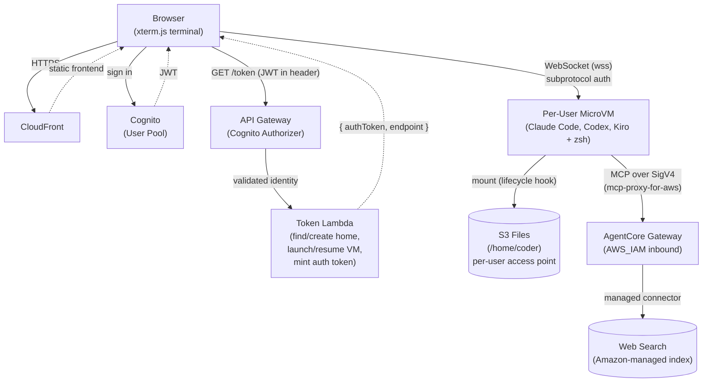

# Remote Developer (rDev)

A browser-based terminal — built for the iPad, works anywhere — that runs
[Claude Code](https://www.anthropic.com/claude-code),
[Codex CLI](https://developers.openai.com/codex/cli/), and
[Kiro CLI](https://kiro.dev/docs/cli/setup.md) inside an **AWS Lambda
MicroVM**, with a persistent home directory backed by **Amazon S3**. Open a URL,
log in, and work with any of the three CLIs in a real shell. Claude Code and
Codex run against Amazon Bedrock (no API keys); Kiro CLI is a separate hosted
service each user signs into with their own account. Close the tab and come
back later — your files, history, and each CLI's login state are still there.

> ⚠️ **This is a demo / small-team project, not a hardened product.** Auth is
> Cognito (admin-created users, per-user MicroVMs), but the sandbox runs with a
> broadly-privileged AWS role. Read the [Security](#security) section before
> deploying anywhere sensitive.

---

## How it works


```mermaid
flowchart TD
    UI["Browser<br/>(xterm.js terminal)"]

    CF["CloudFront"]
    COG["Cognito<br/>(User Pool)"]
    APIGW["API Gateway<br/>(Cognito Authorizer)"]
    TOKENFN["Token Lambda<br/>(find/create home,<br/>launch/resume VM,<br/>mint auth token)"]
    MVM["Per-User MicroVM<br/>(Claude Code, Codex, Kiro + zsh)"]
    S3FILES[("S3 Files<br/>(/home/coder)<br/>per-user access point")]
    ACGW["AgentCore Gateway<br/>(AWS_IAM inbound)"]
    WEBSEARCH[("Web Search<br/>(Amazon-managed index)")]

    UI -->|HTTPS| CF
    CF -.->|static frontend| UI
    UI -->|sign in| COG
    COG -.->|JWT| UI
    UI -->|"GET /token (JWT in header)"| APIGW
    APIGW -->|validated identity| TOKENFN
    TOKENFN -.->|"{ authToken, endpoint }"| UI
    UI -->|"WebSocket (wss)<br/>subprotocol auth"| MVM
    MVM -->|"mount (lifecycle hook)"| S3FILES
    MVM -->|"MCP over SigV4<br/>(mcp-proxy-for-aws)"| ACGW
    ACGW -->|"managed connector"| WEBSEARCH
```

- **Frontend** — a single `index.html` (xterm.js) on S3, served via CloudFront.
  The user signs in against Cognito (via `amazon-cognito-identity-js`), gets a
  JWT, then opens a WebSocket straight to their MicroVM's service-managed
  endpoint, authenticating via the `lambda-microvms.*` subprotocols. On the wire
  it speaks the ttyd binary protocol.
- **Auth — Cognito + API Gateway.** A Cognito User Pool holds admin-created
  users (no self-signup). **API Gateway's Cognito authorizer validates the JWT
  before the token Lambda ever runs** — the Lambda never sees a password, only
  the already-verified identity.
- **Token Lambda** — reads the verified Cognito `sub` from the request context,
  finds-or-creates that user's S3 Files access point (scoped to `/users/<sub>`),
  launches or resumes **that user's own MicroVM**, and mints a short-lived auth
  token. Hand-rolled SigV4, so it's immune to AWS CLI command-name churn.
- **MicroVM image** — Amazon Linux 2023 + Node, Python 3.13, the AWS CLI, `uv`,
  Claude Code, Codex CLI, and Kiro CLI. `terminal.js` is a WebSocket PTY server.
  `claude` defaults to Opus 5.5, `claude-model` selects any current Claude family
  model, and Codex uses Amazon Bedrock's current supported OpenAI catalog. The
  image refreshes a managed MicroVM briefing for each CLI after the user's home
  mount, without replacing CLI history, preferences, or Kiro login state.
  The per-user home is mounted at run time by the `/run` lifecycle hook (which
  receives the access-point id in its payload) — `mount -o accesspoint=<id>` —
  so each user gets an isolated `/home/coder` that persists across restarts.
- **Web search** — native WebSearch/WebFetch aren't available on Bedrock, so
  each in-VM CLI gets managed web search through **Amazon Bedrock AgentCore**:
  the `workspace-web-search` MCP server uses the managed `web-search` connector
  behind an AgentCore Gateway (`AWS_IAM` inbound auth). The VM reaches it via
  the already-baked `mcp-proxy-for-aws`, SigV4-signed with the execution role
  from IMDS — no API keys, and queries stay inside AWS. `mount-home.sh` refreshes
  only this image-owned MCP entry for Claude, Codex, and Kiro while preserving
  their unrelated user configuration.
- **SAM template** (`template.yaml`) — VPC + security group, the S3 buckets
  (frontend / artifacts / workspace), the S3 Files filesystem + mount targets,
  the Cognito pool + authorizer, IAM roles, the token Lambda + API Gateway,
  CloudFront, and a Lambda Network Connector for VPC egress to the S3 Files
  mount targets. One `sam deploy` provisions all of it. The MicroVM image
  itself is **not** part of this template — it's built with plain `aws
  lambda-microvms` CLI commands, run as separate, visible steps after the
  SAM stack exists. See [Deploying](#deploying) for why, and for the full
  walkthrough.

**Per-user isolation:** each Cognito user gets their own MicroVM and their own
home directory (an S3 Files access point scoped to their `sub`). Adding a user
in the pool is all it takes — their first login provisions their VM and home on
demand.

Claude Code defaults to **Claude Opus 5.5**. Use `claude-model opus`,
`claude-model sonnet`, `claude-model haiku`, or `claude-model fable` for the
latest available model in each Claude family. Codex `0.154.0` uses Amazon
Bedrock's current OpenAI catalog: GPT-6 Astra plus GPT-5.6 Sol, Terra, and
Luna. Use `/model` in Codex to switch, or start `codex-astra` for a new
Astra session or `codex-grok` for Grok 4.6 through Bedrock. The workspace
control plane stays in `us-east-1`, while Codex routes its Mantle requests to
`us-west-2`, where Astra and Grok are available. Kiro CLI needs a one-time
device-flow login (`kiro-cli login` — see below) before use; once signed in,
start it with `kiro-cli`. All three tools share workspace files while
retaining their own configuration, history, and login state under
`/home/coder`.

### Signing in to Kiro CLI

Kiro CLI isn't part of this app's AWS account or Bedrock — it's a separate
hosted service, so each user authenticates with their own Kiro account. The
browser terminal has no local browser for Kiro to launch, so it falls back to
its **device-flow** login automatically:

```
kiro-cli login
```

This prints a URL and a one-time code — no port-forwarding or local browser
needed. Open that URL in **any** browser (your phone, another tab, whatever's
on hand), sign in (GitHub, Google, AWS Builder ID, IAM Identity Center, or an
external IdP), and enter the code. Once approved, the session is stored under
`~/.kiro` in that user's S3 Files-backed home, so it's a **one-time step per
user** — it survives VM restarts and recycles, not just the current session.
Check status any time with `kiro-cli whoami`; re-run `kiro-cli login` if a
session expires.

Kiro's own web-search MCP wiring, steering file, and permissions are
image-managed the same way as Claude's and Codex's (see "Web search" above) —
login is the only thing a user has to do by hand.

On each newly mounted workspace, a background refresh runs the official `aws
configure agent-toolkit --yes` workflow under the workspace user. It installs
the latest default AWS skills and configures the AWS MCP server for Claude,
Codex, and Kiro. The image then refreshes the official `aws-core` plugin for
Claude and Codex. The refresh records progress in
`~/.agent-toolkit-status`; it does not touch user projects, API keys, or Kiro
login state.

All three CLIs are configured for unattended work inside this dedicated
MicroVM. Claude Code uses `bypassPermissions`; Codex bypasses approvals and its
local sandbox; Kiro has a persistent allow-all policy. The MicroVM remains the
isolation boundary, and Agent Toolkit safety hooks can still block protected
operations.

---

## Prerequisites

- An AWS account with **Bedrock model access enabled** in **`us-east-1`** for
  the current Claude family, and in **`us-west-2`** (Bedrock Mantle — where the
  `codex` wrapper points model calls) for the OpenAI models Codex uses (GPT-6
  Astra, GPT-5.6 Sol/Terra/Luna) and for xAI's Grok 4.6 (`codex-grok`). The
  deployed image pins Codex `0.154.0`, which includes Astra in the Amazon
  Bedrock model picker.
- **Kiro CLI needs its own account**, unrelated to this AWS account or
  Bedrock — it's a hosted service. Each user signs in themselves on first use;
  see [Signing in to Kiro CLI](#signing-in-to-kiro-cli) below.
- **AWS Lambda MicroVMs** available in your region (this project defaults to
  `us-east-1`, but the stack itself can deploy to any region where MicroVMs
  are available — set `region` in `samconfig.toml`). MicroVMs are a newer
  capability — make sure your account/region has access. Note this is
  independent of the Bedrock region requirement above: Claude Code inside the
  VM always calls Bedrock in `us-east-1`/`us-west-2` regardless of which
  region you deploy the stack itself to.
- **AgentCore web-search connector activation** — separate again from both
  of the above, and only enabled per-account in specific regions today
  (`us-east-1` works) — see [Step 2](#step-2--create-the-agentcore-web-search-gateway).
- Local tooling: **AWS CLI v2**, the **AWS SAM CLI**, and **Node.js 20+**. Docker
  is *not* required — the MicroVM image is built server-side by the build service.
  Inside the workspace, `kiro-cli login` performs its one-time device-flow login;
  its persisted session remains in the user's S3 Files-backed home.

The SAM stack provisions everything, including the **S3 Files filesystem** and
its VPC mount targets (the persistent per-user `/home/coder`). You don't create
anything by hand — `sam deploy` makes it all.

---

## Deploying

Deploying is a sequence of **separate, visible steps** — each one a real AWS
CLI (or `sam`) command shown below, run yourself, in order. This is a
teaching repo: the point is that you can read every command that touches
your account before you run it, not paste one script and trust it. Skip to
[Do it all for me](#do-it-all-for-me) at the end of this section once you've
seen what each step actually does — that's the same sequence wrapped in
scripts, offered purely as a convenience, not as the documentation.

The steps below assume **one continuous shell session** — each step's
commands set shell variables (`$STACK_NAME`, `$IMAGE_ARN`, etc.) that later
steps read. If you come back later and only want to re-run one step, re-set
its variables first; each step below says which ones it needs and how to
re-derive them from the stack/image/gateway directly.

Set your account/region up first:

```bash
cp samconfig.toml.example samconfig.toml
$EDITOR samconfig.toml    # set region, and profile if you don't use your default
```

`samconfig.toml` is how `sam build`/`sam deploy` know the stack name, region,
profile, and capabilities — nothing in this repo reads it except `sam` itself.
It's git-ignored (see `samconfig.toml.example` for the committed template), so
your profile name never gets committed. The commands below that use plain
`aws` (not `sam`) don't read `samconfig.toml` — they use the AWS CLI's normal
resolution (`AWS_PROFILE`/`AWS_REGION` env vars, or your default profile), so
export those first if you're not using your default:

```bash
export AWS_PROFILE=your-profile AWS_REGION=us-east-1
```

Optionally personalize the `admin-create-user` email that shows up in the
stack's Outputs (cosmetic only — it's not a credential) by uncommenting
`parameter_overrides` in `samconfig.toml`:

```toml
parameter_overrides = "LoginEmail=\"you@example.com\""
```

Skip this and it defaults to `you@example.com` — override it per-command
instead with `sam deploy --parameter-overrides LoginEmail=...`, or edit the
created user's email later.

### Step 1 — Deploy the infrastructure with SAM

The whole stack except the MicroVM image is one AWS SAM template
(`template.yaml`): the VPC + NAT + subnets + NFS security group, the three
S3 buckets, the **S3 Files filesystem + mount targets**, the Cognito user
pool + client, the token-vending Lambda + API Gateway (with the Cognito
authorizer), CloudFront, and the VPC-egress network connector.

```bash
sam build
sam deploy
```

No flags needed on a brand-new account — `samconfig.toml` supplies the stack
name, region, profile, and capabilities, and the template's only Parameter
(`LoginEmail`) has a default.

`sam deploy` prints every stack Output when it finishes, including
`TokenApiUrl`, `FrontendUrl`, `UserPoolId`, `LoginEmail`, and
`CreateUserCommand` (Step 6 uses that last one). Inspect them again any time:

```bash
aws cloudformation describe-stacks --stack-name remote-developer \
  --query "Stacks[0].Outputs" --output table
```

The commands below read several of these outputs directly. Save them to
shell variables now:

```bash
STACK_NAME=remote-developer
ARTIFACT_BUCKET=$(aws cloudformation describe-stacks --stack-name $STACK_NAME \
  --query "Stacks[0].Outputs[?OutputKey=='ArtifactBucketName'].OutputValue" --output text)
BUILD_ROLE=$(aws cloudformation describe-stacks --stack-name $STACK_NAME \
  --query "Stacks[0].Outputs[?OutputKey=='BuildRoleArn'].OutputValue" --output text)
S3_FILES_FS_ID=$(aws cloudformation describe-stacks --stack-name $STACK_NAME \
  --query "Stacks[0].Outputs[?OutputKey=='S3FilesFileSystemId'].OutputValue" --output text)
WEBSEARCH_GW_ROLE_ARN=$(aws cloudformation describe-stacks --stack-name $STACK_NAME \
  --query "Stacks[0].Outputs[?OutputKey=='WebSearchGatewayRoleArn'].OutputValue" --output text)
FRONTEND_BUCKET=$(aws cloudformation describe-stacks --stack-name $STACK_NAME \
  --query "Stacks[0].Outputs[?OutputKey=='FrontendBucketName'].OutputValue" --output text)
CF_DIST_ID=$(aws cloudformation describe-stacks --stack-name $STACK_NAME \
  --query "Stacks[0].Outputs[?OutputKey=='CloudFrontDistributionId'].OutputValue" --output text)
USER_POOL_ID=$(aws cloudformation describe-stacks --stack-name $STACK_NAME \
  --query "Stacks[0].Outputs[?OutputKey=='UserPoolId'].OutputValue" --output text)
USER_POOL_CLIENT_ID=$(aws cloudformation describe-stacks --stack-name $STACK_NAME \
  --query "Stacks[0].Outputs[?OutputKey=='UserPoolClientId'].OutputValue" --output text)
TOKEN_API_URL=$(aws cloudformation describe-stacks --stack-name $STACK_NAME \
  --query "Stacks[0].Outputs[?OutputKey=='TokenApiUrl'].OutputValue" --output text)
```

`sam deploy` provisions the frontend's bucket and CloudFront distribution,
but doesn't upload anything into that bucket — `frontend/index.html` ships
with a placeholder for its runtime config (token API URL, region, Cognito
ids), so it needs rendering before it's actually useful:

```bash
RENDERED=/tmp/remote-developer-index.html
APP_CONFIG_JSON="{\"tokenApiUrl\":\"$TOKEN_API_URL\",\"region\":\"$AWS_REGION\",\"userPoolId\":\"$USER_POOL_ID\",\"userPoolClientId\":\"$USER_POOL_CLIENT_ID\"}"
sed "s|<script>window.APP_CONFIG = {}; /\* APP_CONFIG_PLACEHOLDER \*/</script>|<script>window.APP_CONFIG = $APP_CONFIG_JSON;</script>|" \
  frontend/index.html > "$RENDERED"

aws s3 cp "$RENDERED" "s3://$FRONTEND_BUCKET/index.html" \
  --cache-control "no-cache, no-store, must-revalidate" --content-type "text/html"
aws cloudfront create-invalidation --distribution-id "$CF_DIST_ID" --paths "/*"
rm -f "$RENDERED"
```

Without this, `FrontendUrl` returns a `403` (empty bucket) even though the
stack itself deployed successfully. Re-run it any time `frontend/index.html`
changes, or after a stack update that changed any of the values above.

### Step 2 — Create the AgentCore web-search gateway

Each in-VM CLI reaches web search over MCP through an AgentCore Gateway with
a managed `web-search` connector target.

> The web-search **connector** is only activated per-account in specific
> regions today — `us-east-1` works; if you get `"Connector integration
> web-search is not available for this account"` in your stack's own
> region, create the gateway in `us-east-1` instead (as below) — it's
> independent of where the rest of the stack deployed in Step 1, since IAM
> roles are global.

```bash
WEBSEARCH_REGION=us-east-1
GATEWAY_NAME="${STACK_NAME//-/}websearch"

GATEWAY_ID=$(aws bedrock-agentcore-control create-gateway --region $WEBSEARCH_REGION \
  --name "$GATEWAY_NAME" \
  --protocol-type MCP \
  --authorizer-type AWS_IAM \
  --role-arn "$WEBSEARCH_GW_ROLE_ARN" \
  --query gatewayId --output text)

# Wait until it reports READY before adding a target.
aws bedrock-agentcore-control get-gateway --region $WEBSEARCH_REGION \
  --gateway-identifier "$GATEWAY_ID" --query status --output text

aws bedrock-agentcore-control create-gateway-target --region $WEBSEARCH_REGION \
  --gateway-identifier "$GATEWAY_ID" \
  --name "websearch" \
  --target-configuration '{"mcp":{"connector":{"source":{"connectorId":"web-search"},"configurations":[{"name":"WebSearch","parameterValues":{}}]}}}' \
  --credential-provider-configurations '[{"credentialProviderType":"GATEWAY_IAM_ROLE"}]'

# Wait until the target reports READY too, then grab the MCP endpoint URL —
# the image needs this to reach the gateway.
aws bedrock-agentcore-control list-gateway-targets --region $WEBSEARCH_REGION \
  --gateway-identifier "$GATEWAY_ID" --query "items[0].status" --output text

WEBSEARCH_GATEWAY_URL=$(aws bedrock-agentcore-control get-gateway --region $WEBSEARCH_REGION \
  --gateway-identifier "$GATEWAY_ID" --query gatewayUrl --output text)
```

Re-run this step only if you ever delete the gateway — `list-gateways
--query "items[?name=='$GATEWAY_NAME']"` tells you if it already exists.

### Step 3 — Package and upload the MicroVM source

The image is built server-side from a zip of `microvm/` plus its
`Dockerfile`. Three values get substituted into a *copy* of the Dockerfile
first — this account's S3 Files filesystem id, the stack's actual deploy
region, and the web-search gateway's region — never into the committed one:

```bash
DEPLOY_REGION="$AWS_REGION"   # the region you deployed the stack to in Step 1 — NOT
                               # `aws configure get region`, which reads your profile's
                               # own default and can silently differ from where you
                               # actually pointed sam deploy via samconfig.toml
IMAGE_NAME=remote-dev

BUILD_DIR=/tmp/remote-developer-microvm-build
rm -rf "$BUILD_DIR" && cp -R microvm "$BUILD_DIR"
sed -i.bak "s|^ENV S3_FILES_FS_ID=.*|ENV S3_FILES_FS_ID=${S3_FILES_FS_ID}|" "$BUILD_DIR/Dockerfile"
sed -i.bak "s|^ENV DEPLOY_REGION=.*|ENV DEPLOY_REGION=${DEPLOY_REGION}|" "$BUILD_DIR/Dockerfile"
sed -i.bak "s|^ENV WEBSEARCH_REGION=.*|ENV WEBSEARCH_REGION=${WEBSEARCH_REGION}|" "$BUILD_DIR/Dockerfile"
rm -f "$BUILD_DIR/Dockerfile.bak"

ZIP_KEY="microvm/${IMAGE_NAME}.zip"
(cd "$BUILD_DIR" && zip -r "/tmp/${IMAGE_NAME}.zip" . -x "*.DS_Store")
aws s3 cp "/tmp/${IMAGE_NAME}.zip" "s3://$ARTIFACT_BUCKET/$ZIP_KEY"
```

`DEPLOY_REGION` is where the stack lives; `WEBSEARCH_REGION` is where the
gateway lives (from Step 2) — pass both even when they're the same value.

### Step 4 — Create (or update) the MicroVM image

```bash
HOOKS_JSON='{"port":9000,"microvmImageHooks":{"ready":"ENABLED","readyTimeoutInSeconds":180,"validate":"ENABLED","validateTimeoutInSeconds":300},"microvmHooks":{"run":"ENABLED","runTimeoutInSeconds":10,"resume":"ENABLED","resumeTimeoutInSeconds":10,"suspend":"ENABLED","suspendTimeoutInSeconds":10,"terminate":"ENABLED","terminateTimeoutInSeconds":10}}'
RESOURCES_JSON='[{"minimumMemoryInMiB":4096}]'
ENV_VARS_JSON=$(printf '{"S3_FILES_FS_ID":"%s","WEBSEARCH_GATEWAY_URL":"%s"}' "$S3_FILES_FS_ID" "$WEBSEARCH_GATEWAY_URL")
```

**First build** — no image with this name exists yet:

```bash
IMAGE_ARN=$(aws lambda-microvms create-microvm-image \
  --name "$IMAGE_NAME" \
  --base-image-arn "arn:aws:lambda:${DEPLOY_REGION}:aws:microvm-image:al2023-1" \
  --base-image-version "1" \
  --build-role-arn "$BUILD_ROLE" \
  --code-artifact "{\"uri\":\"s3://$ARTIFACT_BUCKET/$ZIP_KEY\"}" \
  --additional-os-capabilities '["ALL"]' \
  --resources "$RESOURCES_JSON" \
  --egress-network-connectors "[\"arn:aws:lambda:${DEPLOY_REGION}:aws:network-connector:aws-network-connector:INTERNET_EGRESS\"]" \
  --hooks "$HOOKS_JSON" \
  --environment-variables "$ENV_VARS_JSON" \
  --query imageArn --output text)
```

**Rebuilding an existing image** — find its ARN, then update in place. If
you're picking this up in a fresh shell (Step 2 wasn't just run), also
re-derive `$WEBSEARCH_GATEWAY_URL` from the existing gateway before building
`$ENV_VARS_JSON` above — otherwise it silently goes into the image empty:

```bash
GATEWAY_NAME="${STACK_NAME//-/}websearch"
GATEWAY_ID=$(aws bedrock-agentcore-control list-gateways --region "$WEBSEARCH_REGION" \
  --query "items[?name=='$GATEWAY_NAME'].gatewayId | [0]" --output text)
WEBSEARCH_GATEWAY_URL=$(aws bedrock-agentcore-control get-gateway --region "$WEBSEARCH_REGION" \
  --gateway-identifier "$GATEWAY_ID" --query gatewayUrl --output text)

IMAGE_ARN=$(aws lambda-microvms list-microvm-images \
  --query "items[?name=='$IMAGE_NAME'].imageArn | [0]" --output text)

aws lambda-microvms update-microvm-image \
  --image-identifier "$IMAGE_ARN" \
  --base-image-arn "arn:aws:lambda:${DEPLOY_REGION}:aws:microvm-image:al2023-1" \
  --base-image-version "1" \
  --build-role-arn "$BUILD_ROLE" \
  --code-artifact "{\"uri\":\"s3://$ARTIFACT_BUCKET/$ZIP_KEY\"}" \
  --additional-os-capabilities '["ALL"]' \
  --resources "$RESOURCES_JSON" \
  --egress-network-connectors "[\"arn:aws:lambda:${DEPLOY_REGION}:aws:network-connector:aws-network-connector:INTERNET_EGRESS\"]" \
  --hooks "$HOOKS_JSON" \
  --environment-variables "$ENV_VARS_JSON"
```

> `update-microvm-image` replaces the entire version config on every call —
> always pass every property, as above, never a partial flag set.

Memory is a fixed tier, not a free-form value: MicroVMs bill continuously at
the configured baseline while running, and auto-burst up to 4x under load,
billed per second only while actually bursting (512→2048 MiB peak,
1024→4096, 2048→8192, 4096→16384, 8192→32768). `RESOURCES_JSON` above uses
4096 MiB baseline / 16384 MiB peak — headroom for sustained Claude Code /
build workloads without paying the 8192 tier's continuous rate for capacity
mostly needed only in bursts. Edit that literal to move tiers.

Then poll until the build finishes — `state` needs to reach `CREATED` or
`UPDATED` **and** `latestActiveImageVersion` needs to be non-empty (state
can flip before the version is populated), which typically takes 5-10
minutes on a first build:

```bash
aws lambda-microvms get-microvm-image --image-identifier "$IMAGE_ARN" \
  --query "{state:state,version:latestActiveImageVersion}"
```

Once it's ready, publish the image ARN to SSM — this is what the token
Lambda reads at runtime (see `TokenFunction`'s comment in `template.yaml`).
It's deliberately **not** a Lambda env var: that would force a redeploy of
the Lambda every time you rebuild the image.

```bash
aws ssm put-parameter --name /remote-developer/image-arn --type String \
  --overwrite --value "$IMAGE_ARN"
```

**You don't launch a persistent MicroVM here** — the token Lambda does that
per user, on demand: when a user logs in, it reads their verified Cognito
`sub`, creates their S3 Files access point, and calls `run-microvm` with the
access-point id in `--run-hook-payload` (the `/run` hook mounts it). The
ingress connectors expose HTTP (the terminal) and SHELL (the `tools/` helpers);
the egress connector reaches the S3 Files mount targets.

Re-run Steps 3-4 any time `microvm/` changes.

### Step 5 — Smoke test (optional)

Nothing in the app requires this — it exists purely so you can confirm the
image actually boots and mounts correctly right after building it, instead
of finding out only when you try to sign in through the browser. It launches
one throwaway MicroVM (with a temporary S3 Files access point, exercising
the real per-user mount path), checks that the terminal server responds over
HTTP, then tears everything down.

Needs `$STACK_NAME`, `$DEPLOY_REGION`, `$S3_FILES_FS_ID`, and `$IMAGE_ARN`
from Steps 1/3/4 — in a fresh shell, re-set `STACK_NAME=remote-developer`
and `DEPLOY_REGION` to whatever region the stack actually deployed to (check
`samconfig.toml`, not `aws configure get region` — see Step 3), and
re-derive the rest as shown in those steps.

```bash
EXECUTION_ROLE=$(aws cloudformation describe-stacks --stack-name $STACK_NAME \
  --query "Stacks[0].Outputs[?OutputKey=='ExecutionRoleArn'].OutputValue" --output text)

SMOKE_AP=$(aws s3files create-access-point \
  --file-system-id "$S3_FILES_FS_ID" \
  --posix-user 'uid=1000,gid=1000' \
  --root-directory 'path=/users/_smoketest,creationPermissions={ownerUid=1000,ownerGid=1000,permissions=0755}' \
  --query 'accessPointId' --output text)

MVM_ID=$(aws lambda-microvms run-microvm \
  --image-identifier "$IMAGE_ARN" \
  --execution-role-arn "$EXECUTION_ROLE" \
  --idle-policy '{"maxIdleDurationSeconds":1800,"suspendedDurationSeconds":600,"autoResumeEnabled":true}' \
  --maximum-duration-in-seconds 28800 \
  --ingress-network-connectors "[\"arn:aws:lambda:${DEPLOY_REGION}:aws:network-connector:aws-network-connector:HTTP_INGRESS\",\"arn:aws:lambda:${DEPLOY_REGION}:aws:network-connector:aws-network-connector:SHELL_INGRESS\"]" \
  --run-hook-payload "{\"accessPointId\":\"$SMOKE_AP\"}" \
  --query microvmId --output text)

# Give snapshot boot + the /run hook mount a moment, then probe ttyd:
sleep 15
MVM_ENDPOINT=$(aws lambda-microvms get-microvm --microvm-identifier "$MVM_ID" --query endpoint --output text)
SMOKE_TOKEN=$(aws lambda-microvms create-microvm-auth-token \
  --microvm-identifier "$MVM_ID" --expiration-in-minutes 5 \
  --allowed-ports '[{"port":8080}]' --query 'authToken."X-aws-proxy-auth"' --output text)
curl -sI -H "X-aws-proxy-auth: $SMOKE_TOKEN" "https://$MVM_ENDPOINT/"

# Tear it down:
aws lambda-microvms terminate-microvm --microvm-identifier "$MVM_ID"
aws s3files delete-access-point --access-point-id "$SMOKE_AP"
```

### Step 6 — Create a user

Auth is Cognito with no self-signup, so you create users yourself. Step 1's
`sam deploy` already printed a ready-to-run command for this as the
`CreateUserCommand` output (built from the `LoginEmail` you set earlier) —
copy it from that output, or fetch it again any time (needs `$STACK_NAME`
— in a fresh shell, `STACK_NAME=remote-developer`):

```bash
aws cloudformation describe-stacks --stack-name $STACK_NAME \
  --query "Stacks[0].Outputs[?OutputKey=='CreateUserCommand'].OutputValue" --output text
```

It looks like:

```bash
aws cognito-idp admin-create-user \
  --user-pool-id <pool-id> --username you@example.com \
  --user-attributes Name=email,Value=you@example.com Name=email_verified,Value=true \
  --temporary-password 'ChangeMe-123!'
```

This creates the user with a **temporary password**. On first sign-in the app
prompts them to choose a new permanent one (Cognito's standard
`NEW_PASSWORD_REQUIRED` flow, which the login screen handles).

- Run it as printed to set that temp password yourself.
- To skip the first-login prompt entirely and set a ready-to-use password:
  ```bash
  aws cognito-idp admin-set-user-password \
    --user-pool-id <pool-id> --username you@example.com \
    --password 'YourReal-Password1!' --permanent
  ```

Now open the CloudFront URL, sign in with that email and password, and you're in
the terminal — with your own MicroVM and persistent home.

### Do it all for me

Once you've read the steps above, `scripts/` has the same sequence wrapped
into three scripts — a convenience for repeat deploys, not a substitute for
understanding what they run:

```bash
./scripts/deploy.sh                  # Step 1 (sam build/deploy) + frontend sync
./scripts/build-microvm-image.sh     # Steps 2-4 (gateway, package, image, SSM)
./scripts/smoke-test-vm.sh           # Step 5 (optional)
# Step 6 still has no script — create the user yourself, see above
```

`./scripts/build-microvm-image.sh` reads `WEBSEARCH_REGION` from your
environment if you want to override the default (`WEBSEARCH_REGION=your-region
./scripts/build-microvm-image.sh`), same as Step 2 above.

### Flags

| Script | Flag | Effect |
|---|---|---|
| `deploy.sh` | *(none)* | SAM build + deploy, then frontend sync |
| `deploy.sh` | `--skip-infra` | Reuse the existing stack — frontend sync only |

### Tearing it down

`aws cloudformation delete-stack --stack-name remote-developer` does **not**
remove everything. `template.yaml` marks `ArtifactBucket`, `WorkspaceBucket`,
and the Cognito `UserPool` with `DeletionPolicy: Retain` — deliberately, so a
stack delete can't accidentally wipe out every user's persistent home or
their Cognito accounts. `FrontendBucket` has no such policy and deletes
normally.

Full order — the stack can't delete while it still owns the gateway/image
(neither is a stack resource) or while its buckets are non-empty:

```bash
# 1. AgentCore gateway (created in WEBSEARCH_REGION, not the stack's own region)
aws bedrock-agentcore-control delete-gateway-target --region "$WEBSEARCH_REGION" \
  --gateway-identifier "$GATEWAY_ID" --target-id "$TARGET_ID"
aws bedrock-agentcore-control delete-gateway --region "$WEBSEARCH_REGION" --gateway-identifier "$GATEWAY_ID"

# 2. MicroVM image
aws lambda-microvms delete-microvm-image --image-identifier "$IMAGE_ARN"

# 3. Empty every bucket sam deploy created — FrontendBucket deletes with the
#    stack; ArtifactBucket and WorkspaceBucket are versioned (S3 Files
#    requires versioning), so `aws s3 rm --recursive` only adds a delete
#    marker and leaves old object versions behind — list and purge every
#    version explicitly, or `delete-bucket` fails with BucketNotEmpty:
aws s3api list-object-versions --bucket "$ARTIFACT_BUCKET" --output json \
  | python3 -c "import sys,json; d=json.load(sys.stdin); print(json.dumps({'Objects':[{'Key':o['Key'],'VersionId':o['VersionId']} for o in d.get('Versions',[])+d.get('DeleteMarkers',[])]}))" \
  > /tmp/versions.json
aws s3api delete-objects --bucket "$ARTIFACT_BUCKET" --delete file:///tmp/versions.json
# repeat the two commands above for $WORKSPACE_BUCKET

# 4. SSM parameter, then the stack itself (deletes FrontendBucket for you)
aws ssm delete-parameter --name /remote-developer/image-arn
aws cloudformation delete-stack --stack-name "$STACK_NAME"

# 5. The three retained resources — only if you want a FULL account cleanup,
#    not just a safe redeploy. This permanently deletes every user's
#    persistent home and Cognito account:
aws cognito-idp delete-user-pool --user-pool-id "$USER_POOL_ID"
aws s3api delete-bucket --bucket "$ARTIFACT_BUCKET"
aws s3api delete-bucket --bucket "$WORKSPACE_BUCKET"
```

---

## Operations

Deploying is the only thing you need to do for normal use — once Step 6 is
done, everything runs from the browser. The helpers in `tools/` are
optional break-glass utilities for reaching *into* a running MicroVM (which has
no SSH; access is over the service ingress connectors). They read
`AWS_PROFILE` / `AWS_REGION` from your environment — export them first:

```bash
export AWS_PROFILE=your-profile AWS_REGION=us-east-1
cd tools && npm install && cd ..   # first time only (installs the `ws` client)
```

MicroVMs are per-user, so both tools need to know **which** user's VM to reach —
pass `--user <email>` (or set `REMOTE_DEVELOPER_USER`). The user must have logged in
at least once so their VM exists.

- **Interactive shell into a user's MicroVM** (SSH-equivalent, over SHELL_INGRESS):

  ```bash
  node tools/exec.js --user you@example.com          # drops to the `coder` user (zsh)
  node tools/exec.js --user you@example.com --root   # stay root (changes don't persist)
  ```

  Double `Ctrl+C` to disconnect.

- **Run a one-off command in a user's MicroVM** (non-interactive — handy for
  scripting or quick inspection):

  ```bash
  node tools/run-remote.js --user you@example.com 'uname -a' 60   # cmd, optional timeout
  ```

- **Logs / debugging:** `cat /tmp/hooks.log` inside the MicroVM shows the S3
  Files mount attempts; app logs are in CloudWatch under
  `/aws/lambda-microvms/<image-name>`.

---

## Security

Auth and isolation are real (Cognito + per-user MicroVMs + per-user homes), but
a few things still warrant care before you point it at anything sensitive:

- **Auth is Cognito, per-user.** Users are admin-created (no self-signup); each
  gets their own MicroVM and a home directory isolated to their `sub`. API
  Gateway validates the JWT before the Lambda runs. Note the `coder` user has
  passwordless `sudo` **inside their own VM** — fine, since the VM and home are
  per-user, but it does mean a user is root within their own sandbox.
- **Broad AWS privileges — the main thing to scope.** The MicroVM runs as
  `MicroVmExecutionRole`: **`PowerUserAccess`** (full access to AWS services)
  **plus boundary-gated IAM writes** so full-stack deploys (`sam deploy`, CDK)
  work from inside the sandbox. The escalation guardrail is a permissions
  boundary (`SandboxPermissionsBoundary`): every role created from the sandbox
  must carry it, it caps those roles at the sandbox's own privilege level, and
  it self-propagates to roles *they* create. IAM users/access keys are never
  grantable, the boundary itself can't be edited or detached, and the
  sandbox's own `remote-developer-*` roles are off-limits. Anything Claude (or the
  user) runs in the terminal wields these credentials (resolved from the
  instance role via IMDS), **and every user's VM shares this one role**.
  Scope `MicroVmExecutionRole` down in `template.yaml` to only the services
  your sandbox needs before using it anywhere real.
- **Bedrock spend.** VMs can call Bedrock freely; there's no per-user budget cap
  wired in. Add one if runaway usage is a concern.
- **Web search spend.** AgentCore Web Search is billed per query (~$7 per 1,000
  at time of writing) and, like Bedrock, has no per-user cap wired in. The
  gateway is shared across all users' VMs.
- **No network isolation of the workload.** MicroVMs have open outbound internet
  by default.

For a production multi-tenant deployment you'd additionally want a per-user
(or per-tenant) scoped execution role rather than one shared `PowerUserAccess`
role, plus spend controls and egress restrictions.

### Deploying from inside the sandbox

The sandbox can run full-stack deploys (`sam deploy`, CDK, CloudFormation)
including role creation — with one requirement: **every IAM role created from
inside the sandbox must carry the permissions boundary**

```
arn:aws:iam::<account-id>:policy/remote-developer-sandbox-boundary-<region>
```

(get the account id from `aws sts get-caller-identity`, and `<region>` from
`aws configure get region` or `$AWS_REGION` — the suffix is required, not
decoration: IAM policy names are a global, account-wide namespace, so a
second deploy of this stack in a different region needs a differently-named
boundary or it collides with the first one). A `CreateRole` without it is
denied — if a deploy fails with `AccessDenied` on `iam:CreateRole`, a missing
boundary is almost always why. How to attach it:

- **SAM** — all function roles at once, in `template.yaml`:

  ```yaml
  Globals:
    Function:
      PermissionsBoundary: arn:aws:iam::<account-id>:policy/remote-developer-sandbox-boundary-<region>
  ```

  or per-role via the `PermissionsBoundary` property on `AWS::IAM::Role`.

- **CDK** — apply it to the whole app so every construct-created role gets it:

  ```json
  // cdk.json
  { "context": { "@aws-cdk/core:permissionsBoundary": {
      "name": "remote-developer-sandbox-boundary-<region>" } } }
  ```

  or per-role: `new iam.Role(..., { permissionsBoundary:
  iam.ManagedPolicy.fromManagedPolicyName(this, 'Pb', 'remote-developer-sandbox-boundary-<region>') })`.

- **CLI** —

  ```bash
  aws iam create-role --role-name my-role \
    --permissions-boundary arn:aws:iam::<account-id>:policy/remote-developer-sandbox-boundary-<region> \
    --assume-role-policy-document file://trust.json
  ```

The boundary caps created roles at the sandbox's own privilege level and
propagates itself: roles created from the sandbox can create further roles,
but only ones carrying the same boundary. The in-VM `CLAUDE.md` briefing
carries these same instructions, so Claude inside the sandbox handles this
automatically.

---

## Repo layout

```
template.yaml         the SAM template — VPC, S3, S3 Files, Cognito, the
                       token Lambda + API Gateway, CloudFront, and the VPC
                       egress connector. Does NOT include the MicroVM image
                       — see scripts/build-microvm-image.sh.
samconfig.toml.example  copy to samconfig.toml and fill in (git-ignored)
functions/
  token-vend/         token-vending Lambda (SigV4, Cognito sub, MicroVM lifecycle)
frontend/index.html   the xterm.js terminal + Cognito login screen
microvm/              MicroVM image
  Dockerfile          AL2023 + Node/Python/uv/AWS CLI + Claude Code, Codex, Kiro CLI
  entrypoint.sh       starts hooks.js + terminal.js
  hooks.js            lifecycle hooks — mounts the per-user home on /run;
                      /validate exercises the cold path for platform prefetch
  mount-home.sh       per-user S3 Files mount (-o accesspoint); refreshes every
                      image-owned CLI config below on every mount
  terminal.js         WebSocket PTY server (ttyd protocol)
  zshrc / bashrc      seeded shell config
  skills/             seeded Claude Code skills

  # Web search (all three CLIs, via the AgentCore gateway)
  mcp-config.js            registers the web-search MCP server into a JSON
                            config — used for ~/.claude.json (Claude) and
                            ~/.kiro/settings/mcp.json (Kiro)
  codex-mcp-config.sh      registers the same server for Codex
                            (~/.codex/config.toml) with a hardlink-safe uv cache

  # Claude Code
  claude-model             picks the latest model in a family (opus/sonnet/
                            haiku/fable) and launches `claude`
  claude-settings-config.js  refreshes bypassPermissions without touching the
                            user's other settings/plugins

  # Codex CLI
  codex                    default wrapper — unattended, Bedrock Mantle (us-west-2)
  codex-astra              Codex session pinned to GPT-6 Astra
  codex-grok               Codex session pinned to Grok 4.6 (native web_search
                            off; workspace-web-search MCP covers current info)
  codex-briefing.md        Codex's image-managed AGENTS.md briefing

  # Kiro CLI
  kiro-microvm.md          Kiro's image-managed steering file
  kiro-permissions.yaml    Kiro's unattended, allow-all permissions (the VM
                            itself is the isolation boundary)

  # Shared
  agent-toolkit-bootstrap.sh  runs `aws configure agent-toolkit --yes` and
                            refreshes the aws-core plugin for Claude + Codex
scripts/
  deploy.sh              Step 1: SAM build + deploy, then frontend sync
  build-microvm-image.sh Step 2: builds the production MicroVM image via the
                         AWS CLI (create/update-microvm-image + poll), and
                         the AgentCore web-search gateway
  smoke-test-vm.sh       Step 3 (optional): launches a throwaway MicroVM,
                         checks it responds, tears it down
  deploy-dev.sh          pushes a build to /dev.html on the same bucket/CDN —
                         for quick frontend iteration without touching production
  deploy-dev-image.sh    builds a separate dev MicroVM image
                         (remote-developer-dev) from the working tree, for
                         rapid microvm/ iteration without touching the
                         production image
tools/                optional break-glass utilities for a running MicroVM
  exec.js / exec.sh   interactive local shell into a user's MicroVM
  run-remote.js       non-interactive remote command runner
  resolve-mvm.js      shared: email → Cognito sub → per-user MicroVM
```

---

## License

[MIT-0](LICENSE) — MIT No Attribution.

This is a personal project and is not an official AWS or Anthropic product.
